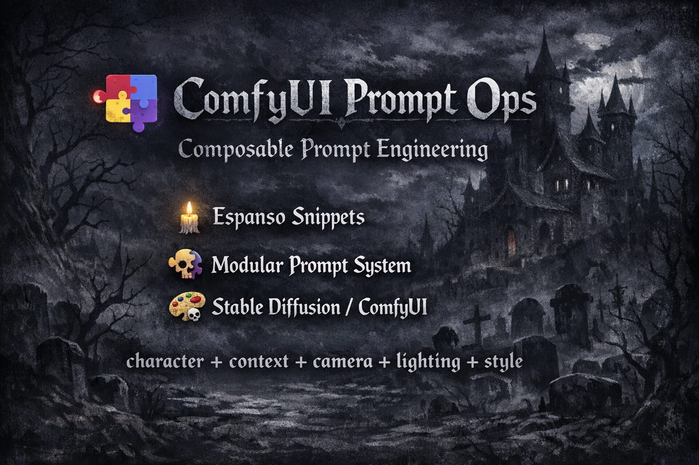

<p align="center">
  
</p>

# 🚀 ComfyUI Prompt Ops


Composable **prompt engineering toolkit for ComfyUI** powered by **Espanso**.

This project turns Espanso into a **modular prompt composition engine** for AI image generation.

Instead of writing long prompts manually, prompts are assembled from reusable building blocks.

---

# ✨ Features

- modular **prompt components**
- **Espanso snippet system**
- **interactive prompt builder**
- automatic **snippet documentation**
- development pipeline for **validation & generation**
- reproducible **PowerShell installer**

---

# ⚡ Quick Start

Clone the repository:

```bash
git clone https://github.com/Delcado19/comfyui-prompt-ops.git
cd comfyui-prompt-ops
```

Run the installer:

```powershell
.\installer\install.ps1
```

The installer automatically:

- installs Chocolatey
- installs Espanso
- installs CopyQ
- checks YAML parsing support
- installs project snippets
- generates snippet documentation
- restarts services if required

---

# 🧠 Example Prompt Workflow

Manual prompt:

```
portrait photo of a woman, cinematic lighting, close-up shot, shallow depth of field
```

Using Prompt Ops:

```
:char_woman :ctx_portrait :cam_closeup :light_soft :style_cinematic
```

Espanso expands the triggers automatically.

---

# 🧩 Prompt Builder

The project includes an **interactive prompt builder**.

Trigger:

```
:prompt
```

The builder allows selecting:

- Context
- Characters
- Scene
- Camera
- Lighting
- Style
- Quality
- Negative prompts
- NSFW modifiers

Selections are combined into a final prompt.

The prompt builder snippet is generated from the snippet library:

```powershell
.\scripts\generate_prompt_builder.ps1
```

Output:

```
snippets/zz_prompt_builder.yml
```

---

# 📦 Installation

Clone the repository:

```bash
git clone https://github.com/Delcado19/comfyui-prompt-ops.git
cd comfyui-prompt-ops
```

Run the installer:

```powershell
.\installer\install.ps1
```

The installer performs:

1. PowerShell version check
2. Chocolatey installation
3. Espanso installation
4. CopyQ installation
5. YAML support verification
6. snippet installation
7. snippet documentation generation
8. service restart

---

# ⚙️ Requirements

## System

- Windows 10 or Windows 11
- PowerShell 7+
- Git
- Internet connection (for Chocolatey)

---

# 📦 YAML Support

Several development scripts rely on the PowerShell command:

```
ConvertFrom-Yaml
```

This command provides YAML parsing functionality.

The installer checks if YAML support is available.

If the command is missing, the installer installs the module:

```
powershell-yaml
```

Manual installation (if required):

```powershell
Install-Module powershell-yaml -Scope CurrentUser
```

Verify installation:

```powershell
Get-Command ConvertFrom-Yaml
```

Expected output:

```
CommandType     Name
-----------     ----
Function        ConvertFrom-Yaml
```

---

# 📂 Project Structure

```
comfyui-prompt-ops
│
├ docs
│   architecture.md
│   banner.png
│   developer_workflow.md
│   prompt_builder.md
│   snippets.md
│   snippet_system.md
│
├ installer
│   install.ps1
│
├ logs
│
├ scripts
│   check_duplicate_triggers.ps1
│   dev.ps1
│   doctor.ps1
│   export_existing_snippets.ps1
│   generate_prompt_builder.ps1
│   generate_snippet_docs.ps1
│   install_snippets.ps1
│   restart_services.ps1
│   validate_snippets.ps1
│   validate_yaml.ps1
│
└ snippets
    comfy_camera.yml
    comfy_characters.yml
    comfy_context.yml
    comfy_lighting.yml
    comfy_negative.yml
    comfy_nsfw.yml
    comfy_quality.yml
    comfy_scene.yml
    comfy_style.yml
    default.yml
    zz_prompt_builder.yml
```

---

# 🧩 Snippet Architecture

Prompt components are organized by category.

| Prefix      | Category         |
| ----------- | ---------------- |
| `:ctx_`     | Context          |
| `:char_`    | Characters       |
| `:scene_`   | Scene            |
| `:cam_`     | Camera           |
| `:light_`   | Lighting         |
| `:style_`   | Style            |
| `:quality_` | Quality          |
| `:neg_`     | Negative prompts |
| `:nsfw_`    | NSFW modifiers   |

Example snippet:

```yaml
matches:
  - trigger: ":ctx_portrait"
    word: true
    replace: "portrait, centered composition, subject facing camera"
```

---

# ⚠️ Snippet Deployment

Snippets inside this repository are **not automatically active in Espanso**.

They must be copied to the Espanso match directory.

Run:

```powershell
.\scripts\install_snippets.ps1
```

This copies snippets from:

```
snippets/
```

to:

```
%APPDATA%\espanso\match
```

Example path:

```
C:\Users\<USER>\AppData\Roaming\espanso\match
```

---

# 🧑‍💻 Developer Workflow

Modify snippets inside:

```
snippets/
```

Run the development pipeline:

```powershell
.\scripts\dev.ps1
```

The pipeline performs:

1. YAML validation
2. snippet validation
3. duplicate trigger detection
4. snippet documentation generation
5. prompt builder generation

---

# 🛠 Dev Utilities

| Script                       | Purpose                        |
| ---------------------------- | ------------------------------ |
| doctor.ps1                   | environment diagnostics        |
| validate_yaml.ps1            | YAML syntax validation         |
| validate_snippets.ps1        | snippet validation             |
| check_duplicate_triggers.ps1 | detect conflicting triggers    |
| generate_snippet_docs.ps1    | generate snippet documentation |
| generate_prompt_builder.ps1  | build prompt builder           |
| install_snippets.ps1         | deploy snippets                |
| restart_services.ps1         | restart Espanso                |

---

# 📚 Documentation

Detailed documentation is available in the **docs** directory:

- `architecture.md`
- `developer_workflow.md`
- `prompt_builder.md`
- `snippets.md`
- `snippet_system.md`

---

# 🔮 Planned Improvements

Possible future improvements:

- automatic **snippet documentation generation via GitHub Actions**
- additional snippet categories
- expanded prompt builder functionality
- improved developer tooling

---

# 🤝 Contributing

Contributions are welcome.

Please read:

```
CONTRIBUTING.md
```

before submitting changes.

---

# 📜 License

MIT License
