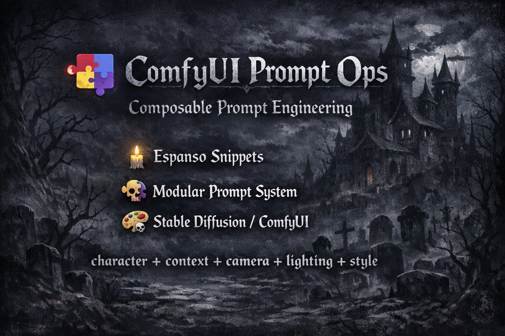

<p align="center">
  
</p>

# 🚀 ComfyUI Prompt Ops


⭐ If you find this project useful, consider starring the repository.

Composable **prompt engineering toolkit for ComfyUI** powered by **Espanso**.

This project turns Espanso into a **modular prompt composition engine** for AI image generation.

Instead of writing large prompts manually, prompts are built from **reusable components**.

---

# ✨ Features

- modular **prompt components**
- **Espanso snippet system**
- **interactive prompt builder**
- local **prompt library admin**
- automatic **snippet documentation**
- **duplicate trigger detection**
- development pipeline for validation & generation
- reproducible **PowerShell installer**
- installer **logging system**

---

# ⚡ Quick Start

Clone the repository:

```bash
git clone https://github.com/Delcado19/comfyui-prompt-ops.git
cd comfyui-prompt-ops
```

Run the installer:

```powershell
.\installer\install.ps1
```

On Linux:

```bash
./installer/install.sh
```

The installer automatically:

- installs Espanso with Winget, falling back to Scoop when Winget is unavailable or fails (Linux: via the distro package manager)
- installs CopyQ with Winget, falling back to Scoop when Winget is unavailable or fails (Linux: via the distro package manager)
- checks YAML parsing support
- installs project snippets
- generates snippet documentation
- restarts services if required

Installer logs are written to:

```
logs/install.log
```

---

# 🧠 Prompt Workflow

### Traditional Prompt

```
portrait photo of a woman, cinematic lighting, close-up shot, shallow depth of field
```

### Prompt Ops

```
:ctx_portrait :cam_close :light_soft :style_cinematic
```

Espanso expands the triggers automatically into the final prompt.

---

# 🧩 Prompt Builder

The project includes an **interactive prompt builder**.

Trigger:

```
:prompt
```

The builder allows selecting:

- Model family preset
- Context
- Scene
- Camera
- Lighting
- Style
- Quality
- Negative prompts
- NSFW modifiers

Selections are combined into a final prompt.

The builder snippet is automatically generated from the snippet library:

```powershell
.\scripts\generate_prompt_builder.ps1
```

Output file:

```
snippets/zz_prompt_builder.yml
```

---

# 🗂 Prompt Library Admin

Start the local admin interface:

```powershell
npm run admin
```

Or use the platform start script:

```powershell
.\start-windows.bat
```

On Windows, the start script opens the admin in your browser and keeps a logging window open. Close that window to stop the server.

```bash
sh ./start-linux.sh
```

Open:

```text
http://127.0.0.1:5177
```

The admin edits the central library:

```text
library/prompt_library.yml
```

Generated outputs:

```text
snippets/comfy_*.yml
snippets/zz_prompt_builder.yml
docs/snippets.md
```

Use the admin for adding, editing, deleting, and generating prompt categories and snippets.

---

# 📦 Installation

Clone repository:

```bash
git clone https://github.com/Delcado19/comfyui-prompt-ops.git
cd comfyui-prompt-ops
```

Run installer:

```powershell
.\installer\install.ps1
```

On Linux:

```bash
./installer/install.sh
```

Installer pipeline:

1. PowerShell version check
2. package manager check
3. Espanso installation via Winget with Scoop fallback (Linux: apt/dnf/pacman/zypper)
4. CopyQ installation via Winget with Scoop fallback (Linux: apt/dnf/pacman/zypper)
5. YAML support verification
6. snippet installation
7. snippet documentation generation
8. service restart

Neither installer requires admin/root privileges for the pipeline itself — only individual Linux package installs may prompt for `sudo`.

---

# ⚙️ Requirements

## System

- Windows 10 / Windows 11, or a Linux distro with apt/dnf/pacman/zypper
- PowerShell 7+ (`pwsh`) — on Linux, also used to run the snippet install/doc-generation scripts
- Git
- Windows: Winget, or Scoop as fallback
- Internet connection

---

# 📦 YAML Support

Several development scripts rely on:

```
ConvertFrom-Yaml
```

If missing, the installer installs:

```
powershell-yaml
```

Manual installation:

```powershell
Install-Module powershell-yaml -Scope CurrentUser
```

Verification:

```powershell
Get-Command ConvertFrom-Yaml
```

Expected output:

```
CommandType     Name
-----------     ----
Function        ConvertFrom-Yaml
```

---

# 🧩 Snippet Architecture

Prompt components are grouped by category.

| Prefix      | Category         |
| ----------- | ---------------- |
| `:model_`   | Model family     |
| `:ctx_`     | Context          |
| `:scene_`   | Scene            |
| `:cam_`     | Camera           |
| `:light_`   | Lighting         |
| `:style_`   | Style            |
| `:qual_`    | Quality          |
| `:neg_`     | Negative prompts |
| `:nsfw_`    | NSFW modifiers   |

Model snippets describe prompt language that matches known local ComfyUI model families such as Z-Image Turbo, Z-Image Base, SDXL, Flux2, Qwen Image Edit, Wan, HiDream, and Krea2. One snippet per base architecture, not per specific checkpoint/finetune, so swapping checkpoints within a family doesn't require new snippets. They do not load models by themselves; they provide reusable text anchors for prompts.

Naming convention:

```
:<category>_<model-or-look>_<descriptor>
```

Examples:

```
:model_zit
:style_zit_gothic_editorial
:scene_moonlit_garden
:qual_zit_material
```

Example snippet:

```yaml
matches:
  - trigger: ":ctx_portrait"
    word: true
    replace: "portrait, centered composition, subject facing camera"
```

---

# ⚠️ Snippet Deployment

Snippets inside this repository are **not automatically active in Espanso**.

They must be copied to the Espanso match directory.

Run:

```powershell
.\scripts\install_snippets.ps1
```

This copies snippets from:

```
snippets/
```

to:

```
%APPDATA%\espanso\match
```

Example path:

```
C:\Users\<USER>\AppData\Roaming\espanso\match
```

---

# 🧑‍💻 Developer Workflow

Modify snippets inside:

```
snippets/
```

Run development pipeline:

```powershell
.\scripts\dev.ps1
```

Pipeline steps:

1. snippet generation from `library/prompt_library.yml`
2. YAML validation
3. PowerShell syntax validation
4. snippet validation
5. duplicate trigger detection
6. prompt builder generation
7. snippet documentation generation

---

# 🛠 Developer Utilities

| Script                       | Purpose                        |
| ---------------------------- | ------------------------------ |
| doctor.ps1                   | environment diagnostics        |
| generate_snippets_from_library.ps1 | generate Espanso snippets from the central library |
| test_powershell_parse.ps1    | PowerShell syntax validation   |
| validate_yaml.ps1            | YAML syntax validation         |
| validate_snippets.ps1        | snippet validation             |
| check_duplicate_triggers.ps1 | detect trigger conflicts       |
| generate_snippet_docs.ps1    | generate snippet documentation |
| generate_prompt_builder.ps1  | build prompt builder           |
| install_snippets.ps1         | deploy snippets                |
| restart_services.ps1         | restart Espanso                |
| import_snippets_to_library.ps1 | one-off migration: rebuild the library from generated snippets, not part of `dev.ps1` |
| export_existing_snippets.ps1 | one-off migration: pull a live Espanso install's snippets into the repo, not part of `dev.ps1` |

---

# 📂 Project Structure

```
comfyui-prompt-ops
│
├ config
│   default.yml
│
├ docs
│   admin.md
│   architecture.md
│   banner.png
│   developer_workflow.md
│   prompt_builder.md
│   snippets.md
│   snippet_system.md
│
├ installer
│   install.ps1
│   install.sh
│
├ library
│   prompt_library.yml
│
├ logs
│   .gitkeep
│
├ scripts
│   check_duplicate_triggers.ps1
│   dev.ps1
│   doctor.ps1
│   export_existing_snippets.ps1
│   generate_prompt_builder.ps1
│   generate_snippet_docs.ps1
│   generate_snippets_from_library.ps1
│   import_snippets_to_library.ps1
│   install_snippets.ps1
│   restart_services.ps1
│   test_powershell_parse.ps1
│   validate_snippets.ps1
│   validate_yaml.ps1
│
└ snippets
    comfy_camera.yml
    comfy_context.yml
    comfy_lighting.yml
    comfy_model.yml
    comfy_negative.yml
    comfy_nsfw.yml
    comfy_quality.yml
    comfy_scene.yml
    comfy_style.yml
    zz_prompt_builder.yml
```

---

# 📚 Documentation

Additional documentation in:

```
docs/
```

- architecture.md
- developer_workflow.md
- prompt_builder.md
- snippets.md
- snippet_system.md

---

# 🤝 Contributing

Contributions are welcome.

Please read:

```
CONTRIBUTING.md
```

before submitting changes.

---

# 📜 License

MIT License
